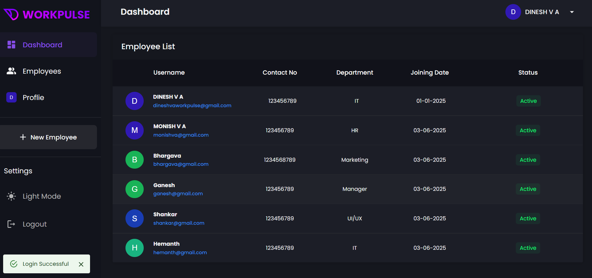
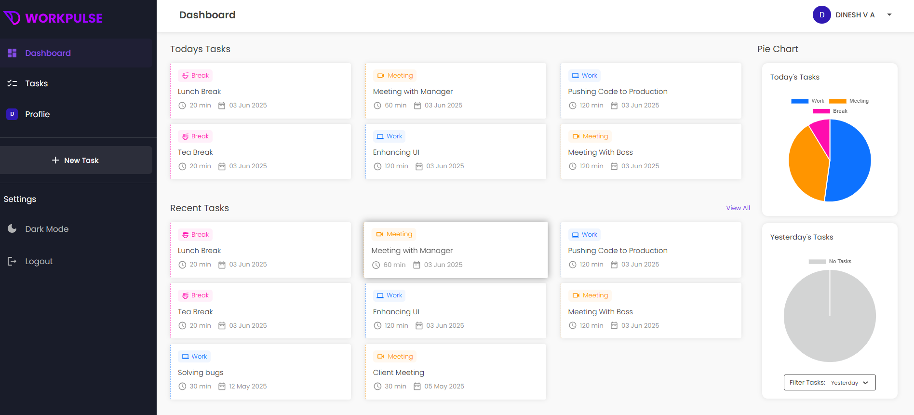

# WorkPulse

**WorkPulse** is a powerful, intuitive web application designed to **streamline daily task tracking** and **enhance workplace productivity**. It bridges the communication gap between employers and employees by offering an efficient system for **task management, activity monitoring, and performance tracking** — all in real-time.

Whether you're managing a remote team or running an in-office setup, WorkPulse empowers **administrators to monitor employee tasks visually** and **employees to log work effortlessly**. With built-in analytics, profile management, and dynamic filtering, WorkPulse makes workforce oversight not just possible — but productive.

#### Web Link: 

| Admin Credentials              | Employee Credentials               |
| --------------------------     | -----------------------------      |
| Email: workpulsetech@gmail.com | Email: dineshvaworkpulse@gmail.com |
| Password- Admin@123            | Password- Employee@123             |


| **Signup**                          |
|------------------------------------|
|        |

<br/>

| **Admin**                                                                                   | **Employee**                                                                                 |
|---------------------------------------------------------------------------------------------|----------------------------------------------------------------------------------------------|
|                                                        |                                                   |
|                                            |                                                         |
|                                                |                                             |
|                                                           |                                             |
|                                                          |                                             |
|                                                          |                                               |
|                                                          |                                                                                              |
|                                                    |                                                                                              |
                                                                                                         |

## 🌟 Features

WorkPulse is packed with features that simplify team productivity tracking and empower seamless collaboration between administrators and employees.

### 🔐 User Authentication

- **Admin Login**: Secure access for administrators using a unique email and password to manage employees and oversee all activity.
- **Employee Login**: Employees log in with their credentials to access personalized dashboards and task functionality.

### 👥 Employee Management (Admin Only)

- **Admin Dashboard**: A centralized hub where admins can register new employees, deactivate or reactivate accounts, and view comprehensive employee data.
- **Profile Management**: Employees can update personal details (excluding their email) and securely change their passwords anytime.

### 🗂️ Task Management

- **Add Daily Tasks**: Employees can log detailed tasks, specifying:
  - Task description  
  - Type (`Work`, `Meeting`, or `Break`)
  - Start time
  - Duration

- **Date Filtering**: Quickly filter tasks by date to view activity logs and performance insights from any given day.

### 📊 Visual Analytics & Reporting

- **Daily Task Insights**:
  - **Pie Chart - Today**: Visual breakdown of current day’s task distribution.
  - **Pie Chart - Yesterday**: Compare task types between yesterday and today for performance tracking.

- **Weekly Overview (Stacked Bar Chart)**:
  - A clear graphical representation of:
    - **Work** time
    - **Meetings**
    - **Non-working** time (including breaks)
  - Enables both admins and employees to identify productivity patterns and optimize time allocation.

With real-time tracking and insightful analytics, WorkPulse helps teams work smarter, not just harder.


# 🚀 Getting Started

Follow these steps to set up and run the WorkPulse application on your local machine.

## 📦 Prerequisites

- [Node.js](https://nodejs.org/) (v16 or higher)
- [MongoDB Atlas](https://www.mongodb.com/cloud/atlas) for the cloud database
- A code editor like [VS Code](https://code.visualstudio.com/)

---

## 🔧 Installation Steps

### 1. Clone the Repository

```bash
git clone https://github.com/v-a-dinesh/WorkPulse.git
cd WorkPulse
```

### 2. Configure the Server

```bash
cd server
```

Create a `.env` file in the server folder with the following variables:

```env
PORT=8800
MONGO_URL=<Your MongoDB Atlas connection string>
JWT_SECRET=<Your JWT secret key>
EMAIL=<Admin email for sending mail (Nodemailer)>
PASSWORD=<Email password or App password>
```

Install backend dependencies:

```bash
npm install
```

Start the server:

```bash
npm start
```

The server will be running on http://localhost:8800

### 3. Configure the Client

```bash
cd ../client
```

Create a `.env` file in the client folder:

```env
REACT_APP_API_URL=http://localhost:8800/api
```

Install frontend dependencies:

```bash
npm install
```

Start the client:

```bash
npm start
```

The frontend will be available at http://localhost:3000


## 🛠️ Technologies Used

WorkPulse is built with a modern web development stack, combining robust backend services with a dynamic, responsive frontend.

### 🌐 Front-End
- **ReactJS**: Core library for building user interfaces using reusable components.
- **HTML5 & CSS3**: Markup and styling for structured and responsive layouts.
- **JavaScript (ES6+)**: For dynamic content rendering and event handling.
- **Axios**: For making secure HTTP requests to the backend.
- **React Router DOM**: Enables client-side routing and seamless navigation between pages.
- **Chart.js**: Used for rendering interactive Pie and Stacked Bar Charts for task visualization.

### ⚙️ Back-End
- **Node.js**: JavaScript runtime environment for executing server-side code.
- **Express.js**: Web framework for building APIs and handling routing, middleware, and request logic.
- **JWT (JSON Web Tokens)**: For secure authentication and authorization.
- **Bcrypt.js**: Used for hashing passwords to ensure security.

### 🗄️ Database
- **MongoDB**: NoSQL database to store user profiles, tasks, and session data.
- **Mongoose**: ODM (Object Data Modeling) library for MongoDB that simplifies schema design and data validation.

### 🔐 Additional Tools & Libraries
- **Dotenv**: For environment variable management.
- **Nodemailer**: Enables email sending functionality (e.g., for password reset).
- **Cors & Helmet**: Security-focused middleware to handle cross-origin requests and secure HTTP headers.


## Contributing

We welcome contributions from the community to enhance WorkPulse. Feel free to submit bug reports, feature requests, or pull requests through the GitHub repository.

## License

This project is licensed under the [MIT License](https://opensource.org/licenses/MIT).

## Contact

For any questions or inquiries, please reach out to the development team at [workpulsetech@gmail.com]

Enjoy using WorkPulse and stay productive!
